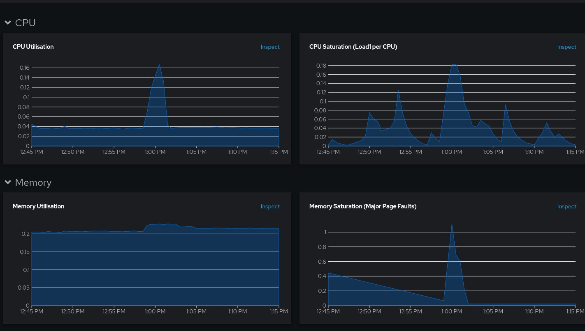
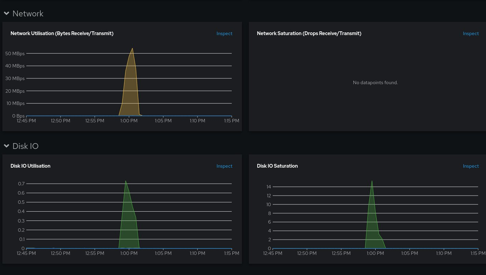
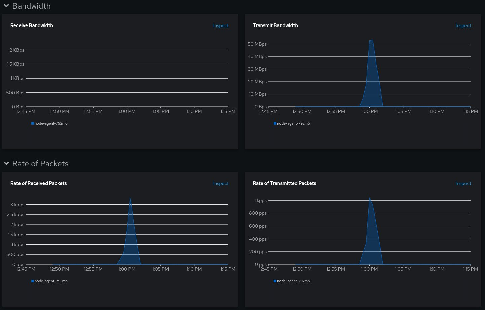
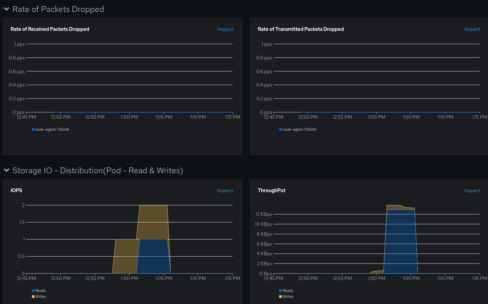
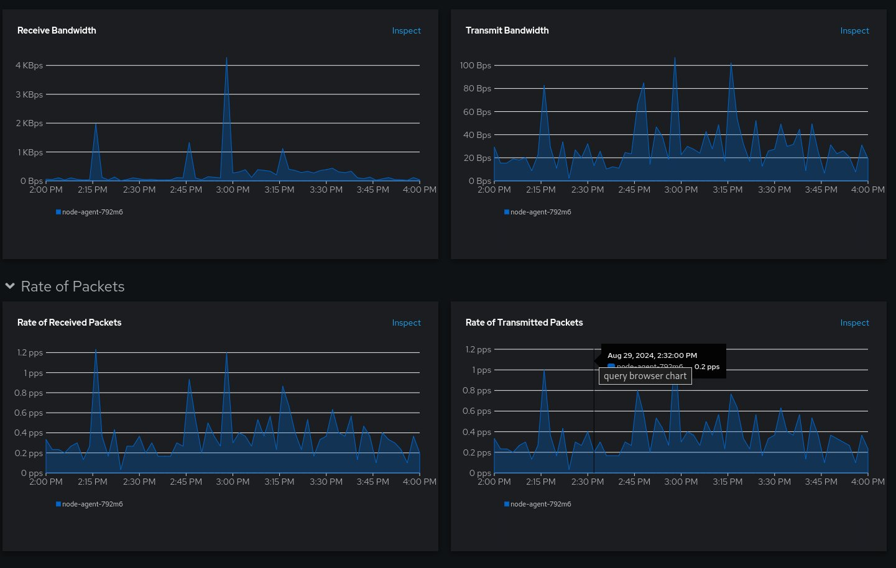
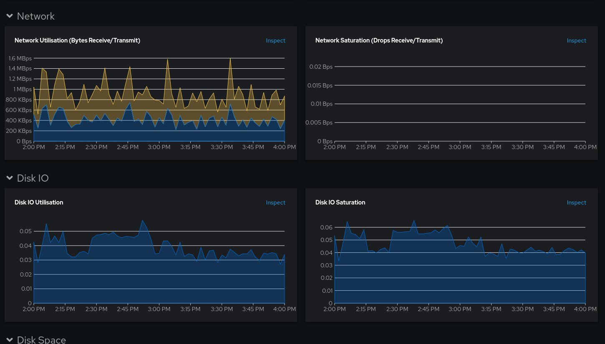
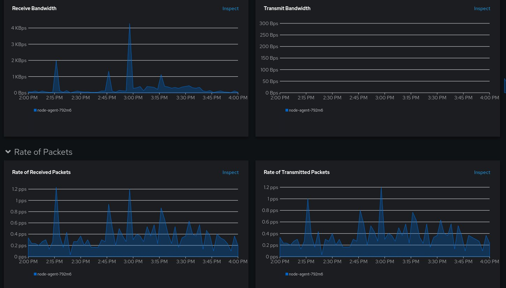
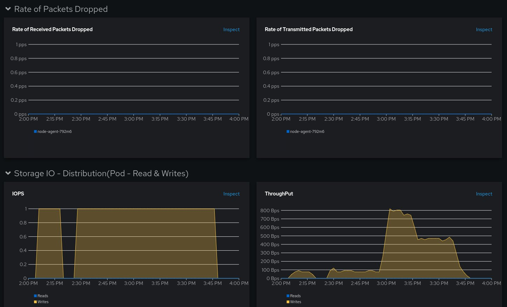

# Operator Installation

```yaml
apiVersion: v1
kind: Namespace
metadata:
  name: openshift-adp
spec: {}
---
apiVersion: operators.coreos.com/v1
kind: OperatorGroup
metadata:
  annotations:
    olm.providedAPIs: Backup.v1.velero.io,BackupRepository.v1.velero.io,BackupStorageLocation.v1.velero.io,CloudStorage.v1alpha1.oadp.openshift.io,DataDownload.v2alpha1.velero.io,DataProtectionApplication.v1alpha1.oadp.openshift.io,DataUpload.v2alpha1.velero.io,DeleteBackupRequest.v1.velero.io,DownloadRequest.v1.velero.io,PodVolumeBackup.v1.velero.io,PodVolumeRestore.v1.velero.io,Restore.v1.velero.io,Schedule.v1.velero.io,ServerStatusRequest.v1.velero.io,VolumeSnapshotLocation.v1.velero.io  
  generateName: openshift-adp-
  namespace: openshift-adp
spec:
  targetNamespaces:
  - openshift-adp
---
apiVersion: operators.coreos.com/v1alpha1
kind: Subscription
metadata:
  labels:
    operators.coreos.com/redhat-oadp-operator.openshift-adp: ""
  name: redhat-oadp-operator
  namespace: openshift-adp
spec:
  channel: stable-1.3
  installPlanApproval: Automatic
  name: redhat-oadp-operator
  source: redhat-operators
  sourceNamespace: openshift-marketplace
  startingCSV: oadp-operator.v1.3.3
```

# OADP configuration for OpenShift

Cloud Credentials secret in namespace OADP

Secret for S3 compatible storage access (AWS)
```console
AWS_CLIENT_ID=TODO         # <<--- HERE YOUR AWS CLIENT ID
AWS_CLIENT_SECRET=TODO     # <<--- HERE YOUR AWS CLIENT SECRET
cat <<EOF > /tmp/credentials-oadp
[default]
aws_access_key_id=$AWS_CLIENT_ID
aws_secret_access_key=$AWS_CLIENT_SECRET
EOF
oc create secret generic cloud-credentials -n openshift-adp --from-file cloud=/tmp/credentials-oadp 
```

CloudStorage
```yaml
apiVersion: oadp.openshift.io/v1alpha1
kind: CloudStorage
metadata:
  name: rosa-csa-oadp
  namespace: openshift-adp
spec:
  creationSecret:
    key: cloud
    name: cloud-credentials
  enableSharedConfig: true
  name: rosa-csa-oadp
  provider: aws
  region: us-east-2
```


DataProtectionApplication

```yaml
apiVersion: oadp.openshift.io/v1alpha1
kind: DataProtectionApplication
metadata:
  name: rosa-csa-dpa
  namespace: openshift-adp
spec:
  backupImages: true
  backupLocations:
    - velero:
        credential:
          key: cloud
          name: cloud-credentials
        default: true
        objectStorage:
          bucket: rosa-csa-oadp
          prefix: velero
        provider: aws
  configuration:
    nodeAgent:
      enable: true
      uploaderType: kopia
    velero:
      defaultPlugins:
        - openshift
        - aws
        - csi
      defaultSnapshotMoveData: true
      featureFlags:
        - EnableCSI
```

# Observability 

See [GitHub repository README.md file about OADP Monitoring](https://github.com/openshift/oadp-operator/blob/master/docs/oadp_monitoring.md) for more information. ROSA comes with the User Workload Monitoring flag enabled, therefore it may only be needed to create the ServiceMonitor resource for Velero's port 8085 as per the previously referenced documentation: 

```yaml
apiVersion: monitoring.coreos.com/v1
kind: ServiceMonitor
metadata:
  labels:
    app: oadp-service-monitor
  name: oadp-service-monitor
  namespace: openshift-adp
spec:
  endpoints:
  - interval: 30s
    path: /metrics
    targetPort: 8085
    scheme: http
  selector:
    matchLabels:
      app.kubernetes.io/name: "velero"
```

# Petclinic installation for benchmarking

```console
export NAMESPACE_PETCLINIC=petclinic-benchmark${FACTOR}gb
cat <<EOF | oc apply -f -
apiVersion: v1
kind: Namespace
metadata:
  name: $NAMESPACE_PETCLINIC
spec: {}
---
apiVersion: apps/v1
kind: Deployment
metadata:
  annotations:
  labels:
    app: spring-petclinic
    app.kubernetes.io/component: web
    app.kubernetes.io/instance: spring-petclinic
    app.kubernetes.io/name: spring-petclinic
    app.kubernetes.io/part-of: spring-petclinic
    app.openshift.io/runtime: java
  name: spring-petclinic
  namespace: $NAMESPACE_PETCLINIC
spec:
  replicas: 1
  selector:
    matchLabels:
      app: spring-petclinic
  template:
    metadata:
      labels:
        app: spring-petclinic
    spec:
      containers:
      - name: spring-petclinic
        imagePullPolicy: Always
        image: quay.io/rdiazgav/spring-petclinic:latest
        livenessProbe:
          failureThreshold: 3
          httpGet:
            path: /
            port: 8080
            scheme: HTTP
          initialDelaySeconds: 45
          periodSeconds: 10
          successThreshold: 1
          timeoutSeconds: 1
        ports:
        - containerPort: 8080
          protocol: TCP
        - containerPort: 8443
          protocol: TCP
        - containerPort: 8778
          protocol: TCP
        readinessProbe:
          failureThreshold: 3
          httpGet:
            path: /
            port: 8080
            scheme: HTTP
          initialDelaySeconds: 45
          periodSeconds: 10
          successThreshold: 1
          timeoutSeconds: 5
---
apiVersion: apps/v1
kind: Deployment
metadata:
  name: mysql-deployment
  namespace: $NAMESPACE_PETCLINIC
spec:
  replicas: 1
  selector:
    matchLabels:
      app: mysql
  template:
    metadata:
      labels:
        app: mysql
    spec:
      containers:
        - name: mysql
          image: mysql:latest
          env:
            - name: MYSQL_ROOT_PASSWORD
              value: root
            - name: MYSQL_DATABASE
              value: petclinic
            - name: MYSQL_USER
              value: petclinic
            - name: MYSQL_PASSWORD
              value: petclinic
          ports:
            - containerPort: 3306
          volumeMounts:
            - name: mysql-data
              mountPath: /var/lib/mysql
      volumes:
        - name: mysql-data
          persistentVolumeClaim:
            claimName: mysql-data-pvc-${FACTOR}gb
---
apiVersion: v1
kind: Service
metadata:
  name: mysql-service
  namespace: $NAMESPACE_PETCLINIC
spec:
  selector:
    app: mysql
  ports:
    - protocol: TCP
      port: 3306
      targetPort: 3306
---
apiVersion: v1
kind: PersistentVolumeClaim
metadata:
  name: mysql-data-pvc-${FACTOR}gb
  namespace: $NAMESPACE_PETCLINIC
spec:
  accessModes:
    - ReadWriteOnce
  resources:
    requests:
      storage: ${FACTOR}Gi # Specify the desired storage size
---
apiVersion: v1
kind: Service
metadata:
  labels:
    app: spring-petclinic
  name: spring-petclinic
  namespace: $NAMESPACE_PETCLINIC
spec:
  ports:
  - name: 8080-tcp
    port: 8080
    protocol: TCP
    targetPort: 8080
  - name: 8443-tcp
    port: 8443
    protocol: TCP
    targetPort: 8443
  - name: 8778-tcp
    port: 8778
    protocol: TCP
    targetPort: 8778
  selector:
    app: spring-petclinic
  sessionAffinity: None
  type: ClusterIP
---
apiVersion: route.openshift.io/v1
kind: Route
metadata:
  labels:
    app: spring-petclinic
  name: spring-petclinic
  namespace: $NAMESPACE_PETCLINIC
spec:
  port:
    targetPort: 8080-tcp
  to:
    kind: Service
    name: spring-petclinic
    weight: 100
  tls: 
    termination: edge
---
EOF
```

# Create benchmark information 
```console
FILE_BENCHMARK_SIZE=$(( $FACTOR / 2 ))
oc exec -n $NAMESPACE_PETCLINIC deploy/mysql-deployment -it -- \
  /bin/sh -c "head -c ${FILE_BENCHMARK_SIZE}G < /dev/urandom > /var/lib/mysql/testfile.benchmark${FACTOR}gb.bin"
oc exec -n $NAMESPACE_PETCLINIC deploy/mysql-deployment -it -- \
  /bin/sh -c "sha1sum /var/lib/mysql/testfile.benchmark${FACTOR}gb.bin > /var/lib/mysql/testfile.sha1.txt && cat /var/lib/mysql/testfile.sha1.txt"
```

# Execute Benchmark Backup

## Scripts

```console
cat <<EOF | oc create -f - 
apiVersion: velero.io/v1
kind: Backup
metadata:
  generateName: backup-${NAMESPACE_PETCLINIC}-
  namespace: openshift-adp
spec:
  csiSnapshotTimeout: 24h00m0s
  itemOperationTimeout: 24h0m0s
  includedNamespaces:
    - $NAMESPACE_PETCLINIC
  snapshotMoveData: true
EOF
```

# Results

## Disk 10G / Data > 5G 
- *Backup*: 3m 27s 
- *Restore*: 3m 05s

### Node Metrics from 'Observe' (backup):



### POD Metrics from 'Observe' (backup):



### Node Metrics from 'Observe' (restore):


### POD Metrics from 'Observe' (restore):


## Disk 100G / Data > 50G 
- *Backup*: 1h 14m 
- *Restore*: 37m
  
### Node Metrics from 'Observe' (backup):



### POD Metrics from 'Observe' (backup):


